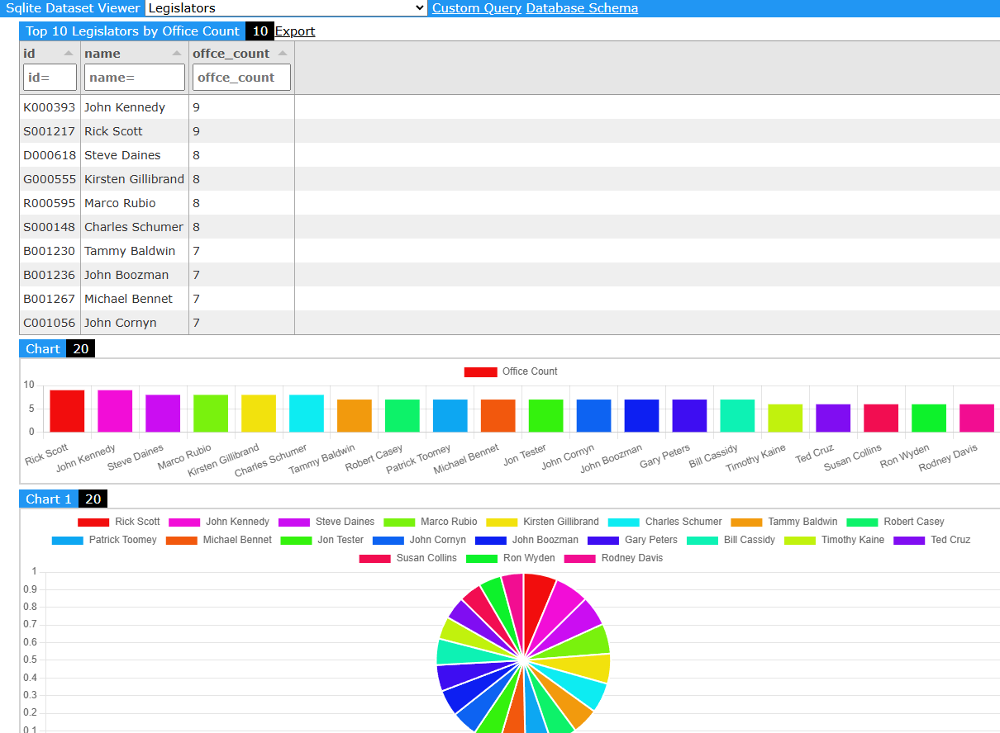

# SQLite Browser Dashboard

A web-based dashboard for viewing and querying SQLite databases with configurable views and filters.



## Features

- Load multiple SQLite databases
- Configurable dashboard templates
- Interactive data grids with filtering and sorting
- Custom SQL query interface
- Nested data views with parent-child relationships
- Real-time header filtering
- Chart visualizations (bar, line, pie, doughnut)
- Row context menus with templated URLs
- GitHub pages hostable
- Supports loading sqlite databases from GitHub pages


## Live Demo
https://unclepaul84.github.io/sqlite-browser-dashboard/?url=/sqlite-data-host/#dataset/Legislators

## Configuration

#### Example
https://github.com/unclepaul84/sqlite-data-host/blob/main/index.json

Create an `index.json` file with the following structure:

```json
{
  "datasets": [
    {
      "title": "Dataset Name",
      "db_url": "path/to/database.sqlite",
      "dashboard_items_tempate": "template_name"
    }
  ],
  "dashboard_templates": [
    {
      "name": "template_name",
      "dashboard_items": [
        {
          "title": "Sales Grid",
          "type": "grid",
          "query": "SELECT * FROM sales",
          "grid_row_menus": [
            {
              "label": "View Details",
              "url": "https://example.com/sale/${id}"
            }
          ]
        },
        {
          "title": "Sales Chart",
          "type": "chart",
          "chartType": "bar",
          "query": "SELECT category, SUM(amount) as total FROM sales GROUP BY category",
          "options": {
            "xField": "category",
            "yField": "total",
            "title": "Sales by Category"
          }
        },
        {
          "title": "Detail View - ${id}",
          "type": "grid",
          "query": "SELECT * FROM details WHERE parent_id = ${id}",
          "parent": "Sales Grid",
          "templated": true
        }
      ]
    }
  ]
}
```

### Configuration Fields

#### Dashboard Item Configuration
- `type`: Visualization type (`grid` or `chart`)
- `title`: Display name for the view (supports templating with ${variable})
- `query`: SQL query to execute (supports templating)
- `templated`: Boolean indicating if this is a template view
- `parent`: Title of the parent view (for nested views)
#### Grid Configuration
- `grid_row_menus`: Array of context menu items for grid rows
  - `label`: Display text for the menu item
  - `url`: URL template with row data variables (supports ${variable} syntax)

#### Dashboard Template Configuration
- `name`: Unique identifier for the template
- `dashboard_items`: Array of view configurations
  - `title`: Display name for the view (supports templating with ${variable})
  - `query`: SQL query to execute (supports templating)
  - `templated`: Boolean indicating if this is a template view
  - `parent`: Title of the parent view (for nested views)

#### Chart Configuration
- `chartType`: Type of chart (`bar`, `line`, `pie`, `doughnut`)
- `options`: Chart display options
  - `xField`: Column name for X-axis data
  - `yField`: Column name for Y-axis data
  - `title`: name of the data point

### Template Variables

Template variables can be used in both titles and queries using `${variable}` syntax. Variables are populated from the parent row's data when clicking on a row.

Example:
```sql
SELECT * FROM orders WHERE customer_id = ${id}
```

## Grid Features

Each grid includes:
- Header filters for each column
- Click-to-sort column headers
- Row count display
- Resizable columns
- Live filtering

## Custom Queries

The dashboard includes a custom query interface that allows:
- Direct SQL query execution
- Table listing
- Results displayed in a filterable grid
- Error handling with toast notifications

## Usage

1. Host the files on a web server or GitHub pages
2. Configure your `index.json` file
3. Access the dashboard via URL with `?url=path/to/config/directory`
4. Select a dataset from the dropdown to load views

## Technical Requirements

- Modern web browser with JavaScript enabled
- Web server to host static files
- SQLite databases accessible via HTTP


## Roadmap
optimize sqlite fetching https://github.com/phiresky/sql.js-httpvfs
