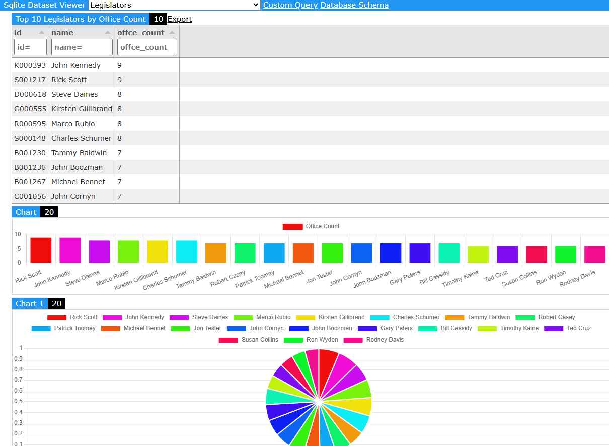

# SQLite Browser Dashboard

Browser based (SPA) based dashboard engine for viewing and querying SQLite databases with configurable views and filters.



## Features

- Load multiple SQLite databases
- Configurable dashboard templates
- Interactive data grids with filtering and sorting
- **Tile widgets for KPI displays with clickable filtering** (NEW)
- Custom SQL query interface
- Nested data views with parent-child relationships
- Real-time header filtering
- Chart visualizations (bar, line, pie, doughnut)
- Row context menus with templated URLs
- GitHub pages hostable
- Supports loading sqlite databases from GitHub pages
- Suports markdown and mermaid rendering in grid


## Live Demo
https://unclepaul84.github.io/sqlite-browser-dashboard/?url=/sqlite-data-host/#dataset/Legislators

## Configuration

#### Example
https://github.com/unclepaul84/sqlite-data-host/blob/main/index.json

Create an `index.json` file with the following structure:

```json
{
  "datasets": [
    {
      "title": "Dataset Name",
      "db_url": "path/to/database.sqlite",
      "dashboard_items_tempate": "template_name"
    }
  ],
  "dashboard_templates": [
    {
      "name": "template_name",
     "documentation_url": "sales.md",
      "dashboard_items": [
        {
          "title": "Sales Grid",
          "type": "grid",
          "query": "SELECT * FROM sales",
          "grid_row_menus": [
            {
              "label": "View Details",
              "url": "https://example.com/sale/${id}"
            }
          ]
        },
        {
          "title": "Sales Chart",
          "type": "chart",
          "chartType": "bar",
          "query": "SELECT category, SUM(amount) as total FROM sales GROUP BY category",
          "options": {
            "xField": "category",
            "yField": "total",
            "title": "Sales by Category"
          }
        },
        {
          "title": "Detail View - ${id}",
          "type": "grid",
          "query": "SELECT * FROM details WHERE parent_id = ${id}",
          "parent": "Sales Grid",
          "templated": true
        }
      ]
    }
  ]
}
```

### Configuration Fields

#### Dashboard Item Configuration
- `type`: Visualization type (`grid`, `chart`, or `tiles`)
- `title`: Display name for the view (supports templating with ${variable} when templated=True)
- `query`: SQL query to execute (supports templating) - not used for tiles
- `templated`: Boolean indicating if this is a template view
- `parent`: Title of the parent view (for nested(templated) views)

#### Tile Widget Configuration (NEW)

Tile widgets display key performance indicators (KPIs) as colored cards showing numeric values from SQL queries. Users can click tiles to filter child grids.

**Important Constraints:**
- Only one tile widget allowed per dashboard template
- Tile widget must be the first item in `dashboard_items` array
- Child grids use `${tile_name}` variable substitution

**Configuration Structure:**
```json
{
  "type": "tiles",
  "title": "KPI Overview",
  "config": {
    "tiles": [
      {
        "name": "Active Orders",
        "query": "SELECT COUNT(*) FROM orders WHERE status = 'Active'",
        "description": "Orders currently being processed",
        "color": "#4CAF50"
      },
      {
        "name": "Completed",
        "query": "SELECT COUNT(*) FROM orders WHERE status = 'Completed'",
        "description": "Successfully delivered",
        "color": "#2196F3"
      }
    ]
  }
}
```

**Tile Configuration Fields:**
- `name` (required): Tile identifier - used for `${tile_name}` substitution in child queries
- `query` (required): SQL query returning a single numeric value (first column of first row)
- `description` (optional): Explanatory text displayed below the value
- `color` (optional): CSS color value for tile background (hex, rgb, named colors) - default: `#4A90E2`

**Child Grid with Tile Filtering:**
```json
{
  "type": "grid",
  "title": "Order Details",
  "parent": "KPI Overview",
  "query": "SELECT * FROM orders WHERE status = '${tile_name}'"
}
```

When a user clicks the "Active Orders" tile, the child grid query becomes:
```sql
SELECT * FROM orders WHERE status = 'Active'
```

**Tile Query Examples:**
```sql
-- Count query
SELECT COUNT(*) FROM orders WHERE status = 'Pending'

-- Sum query
SELECT SUM(total) FROM orders WHERE date >= '2025-01-01'

-- Average query
SELECT ROUND(AVG(price), 2) FROM products

-- Complex aggregation
SELECT COUNT(DISTINCT customer_id) FROM orders
```

**Value Formatting:**
- Numbers < 1,000,000: Formatted with thousands separators (e.g., `1,234,567`)
- Numbers >= 1,000,000: Abbreviated as millions (e.g., `1.2M`)
- Numbers >= 1,000,000,000: Abbreviated as billions (e.g., `3.4B`)
- Non-numeric values: Displayed as-is
- NULL/empty results: Displayed as `N/A`

**Text Contrast:**
Tile text color automatically adjusts (black or white) based on background color luminance for optimal readability (WCAG compliant).

**Responsive Layout:**
- Desktop: Tiles display in flexible row with wrapping
- Tablet (768px): 2-3 tiles per row
- Mobile (480px): 1 tile per row

**Visual States:**
- Default: Card with subtle shadow
- Hover: Lift effect with enhanced shadow
- Active (clicked): Bold border highlight

**Example Full Dashboard with Tiles:**
```json
{
  "dashboard_templates": [
    {
      "name": "Sales Dashboard",
      "dashboard_items": [
        {
          "type": "tiles",
          "title": "Sales KPIs",
          "config": {
            "tiles": [
              {
                "name": "Today",
                "query": "SELECT COUNT(*) FROM orders WHERE date(order_date) = date('now')",
                "description": "Orders today",
                "color": "#4CAF50"
              },
              {
                "name": "This Week",
                "query": "SELECT COUNT(*) FROM orders WHERE date(order_date) >= date('now', '-7 days')",
                "description": "Last 7 days",
                "color": "#2196F3"
              },
              {
                "name": "Total Revenue",
                "query": "SELECT ROUND(SUM(total), 2) FROM orders",
                "description": "All-time sales",
                "color": "#FF9800"
              }
            ]
          }
        },
        {
          "type": "grid",
          "title": "Filtered Orders",
          "parent": "Sales KPIs",
          "query": "SELECT * FROM orders WHERE date(order_date) >= date('now', '-' || CASE '${tile_name}' WHEN 'Today' THEN 0 WHEN 'This Week' THEN 7 ELSE 365 END || ' days')"
        },
        {
          "type": "grid",
          "title": "All Products",
          "query": "SELECT * FROM products ORDER BY category"
        }
      ]
    }
  ]
}
```

**Validation Rules:**

The system validates tile widget configurations before rendering:

| Rule | Severity | Message |
|------|----------|---------|
| Multiple tile widgets in template | Error | "Only one tile widget allowed per dashboard template" |
| Tile widget not first item | Error | "Tile widget must be the first dashboard item" |
| Empty tiles array | Error | "Tile widget must contain at least one tile" |
| Missing tile name | Error | "Tile missing required field 'name' at index {i}" |
| Missing tile query | Error | "Tile missing required field 'query' at index {i}" |
| Duplicate tile names | Warning | "Duplicate tile name '{name}' found" |
| Invalid color format | Warning | "Invalid color '{color}', using default" |

Errors block rendering; warnings display but allow dashboard to load.

**See Example:**
- Configuration: [docs/examples/tiles-example/index.json](docs/examples/tiles-example/index.json)
- Sample Database: [docs/examples/tiles-example/sample.db](docs/examples/tiles-example/sample.db)
- Validation Tests: [docs/examples/tiles-example/validation-tests/](docs/examples/tiles-example/validation-tests/)

#### Grid Configuration
- `grid_row_menus`: Array of context menu items for grid rows
  - `label`: Display text for the menu item
  - `url`: URL template with row data variables (supports ${variable} syntax)

#### Dashboard Template Configuration
- `name`: Unique identifier for the template
- `documentation_url`: path to markdown file
- `dashboard_items`: Array of view configurations
  - `title`: Display name for the view (supports templating with ${variable})
  - `query`: SQL query to execute (supports templating)
  - `templated`: Boolean indicating if this is a template view
  - `parent`: Title of the parent view (for nested views)

#### Chart Configuration
- `chartType`: Type of chart (`bar`, `line`, `pie`, `doughnut`)
- `options`: Chart display options
  - `xField`: Column name for X-axis data
  - `yField`: Column name for Y-axis data
  - `title`: name of the data point

### Template Variables

Template variables can be used in both titles and queries using `${variable}` syntax when dashboard_item.templated=True. Variables are populated from the parent row's data when clicking on a row.

Example:
```sql
SELECT * FROM orders WHERE customer_id = ${id}
```

## Grid Features

Each grid includes:
- Header filters for each column
- Click-to-sort column headers
- Row count display
- Resizable columns
- Live filtering
- right click menu items (if configured)
- mermaid and markdown rendering in grid cells

### Mermaid and Markdown Rendering
Mermaid diagrams and Markdown content can be rendered directly in grid cells. To have cell rendered as Mermaid or Markdown, use the following syntax in your SQL query:
``` sql
SELECT
  id,
  name,
  markdown_column AS content_md,
  mermaid_column AS content_mermaid

 FROM your_table 
 
 ```
 Nothe that the columns `content_md` and `content_mermaid` will be rendered as Markdown and Mermaid diagrams respectively in the grid cells because the are suffixed with `_md` and `_mermaid`.
 
 ## Custom Queries


The dashboard includes a custom query interface that allows:
- Direct SQL query execution
- Table listing
- Results displayed in a filterable grid

## Usage

1. Fork this repo
1. Enable GitHub Pages on it
2. Create another repo to host index.js and your SqliteDatabase
3. Enable GitHub pages on it
5. Configure your `index.json` file
6. Access the dashboard via URL with `?url=path/to/config/directory` parameter 
7. Select a dataset from the dropdown to load views

## Technical Requirements

- Modern web browser with JavaScript enabled
- Web server to host static files
- SQLite databases accessible via HTTP


## Roadmap
optimize sqlite fetching https://github.com/phiresky/sql.js-httpvfs
