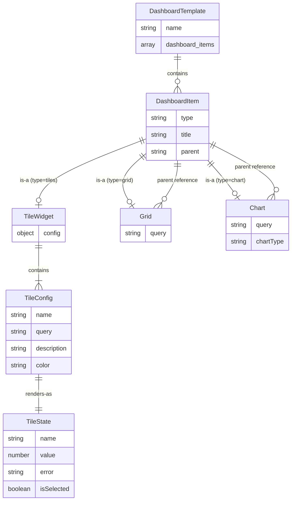

# Data Model: Tile Widget

**Feature**: Tile Widget Dashboard Component  
**Date**: 2025-10-31  
**Phase**: 1 - Design

## Overview

This document defines the data structures for the tile widget feature, including configuration schema, runtime state, and relationships to existing entities.

## Configuration Entities

### 1. Tile Widget Dashboard Item

Represents a tile widget in the dashboard configuration.

**Schema**:
```javascript
{
  "type": "tiles",              // REQUIRED: Must be literal "tiles"
  "title": string,              // REQUIRED: Display title for widget (used in parent references)
  "config": {                   // REQUIRED: Tile-specific configuration
    "tiles": TileConfig[]       // REQUIRED: Array of 1+ tile configurations
  }
}
```

**Validation Rules**:
- `type` must equal `"tiles"` (string literal)
- `title` must be unique within dashboard template (existing rule)
- `config.tiles` array must contain at least 1 tile
- Tile widget can only appear once per dashboard template
- Tile widget must be first item in `dashboard_items` array (index 0)

**Relationships**:
- Extends existing `DashboardItem` entity (which also includes grid, chart types)
- Can be referenced as `parent` by grid/chart dashboard items
- Belongs to one `DashboardTemplate`

---

### 2. Tile Configuration

Individual tile within a tile widget.

**Schema**:
```javascript
{
  "name": string,               // REQUIRED: Tile identifier (used for ${tile_name} substitution)
  "query": string,              // REQUIRED: SQL query returning numeric value
  "description": string,        // OPTIONAL: Explanatory text displayed on tile
  "color": string               // OPTIONAL: CSS color value (default: "#4A90E2")
}
```

**Field Specifications**:

| Field | Type | Required | Default | Validation |
|-------|------|----------|---------|------------|
| name | string | Yes | N/A | Non-empty; unique within tile widget (warning if duplicate) |
| query | string | Yes | N/A | Valid SQL syntax (validated at runtime) |
| description | string | No | "" | Any string (truncated if >200 chars for display) |
| color | string | No | "#4A90E2" | Any CSS color value; invalid values fall back to default |

**Validation Rules**:
- `name` must be non-empty string
- `query` must be non-empty string
- Duplicate `name` values within same tile widget: warning (not error)
- `color` validation: warn on invalid CSS color, use default

**Example**:
```json
{
  "name": "Active Orders",
  "query": "SELECT COUNT(*) FROM orders WHERE status = 'Active'",
  "description": "Orders currently being processed",
  "color": "#4CAF50"
}
```

---

## Runtime Entities

### 3. Tile State

Runtime state for a rendered tile.

**Structure**:
```javascript
{
  name: string,           // From TileConfig.name
  value: number | string, // Query result value (numeric preferred, string fallback)
  description: string,    // From TileConfig.description
  color: string,          // From TileConfig.color (validated CSS color)
  textColor: string,      // Calculated contrast color (#000000 or #FFFFFF)
  error: string | null,   // Error message if query failed, null otherwise
  isSelected: boolean     // True if this tile is currently clicked/active
}
```

**State Transitions**:
1. **Initial**: After tile widget renders, all tiles have `isSelected: false`
2. **Selected**: When user clicks tile, `isSelected: true` for clicked tile, `false` for others
3. **Error**: If query fails, `error` populated, `value` set to "N/A"

---

### 4. Global Tile Context

Global state for tile interactions (stored in `window` object).

**Structure**:
```javascript
window.tile_widget_state = {
  current_tile_name: string | null,  // Name of currently selected tile
  tile_widget_title: string | null   // Title of active tile widget (for child lookups)
}
```

**Purpose**: Enables template variable substitution in child grid queries.

**Usage**:
```javascript
// When tile clicked
window.tile_widget_state.current_tile_name = "Active Orders";

// In child grid query
const query = "SELECT * FROM orders WHERE status = '${tile_name}'";
const substituted = replaceStringTemplateValues(query, { 
  tile_name: window.tile_widget_state.current_tile_name 
});
```

---

## Relationships

### Entity Relationship Diagram



### Parent-Child Relationships

**Tile Widget as Parent**:
```javascript
// Tile widget configuration
{
  "type": "tiles",
  "title": "KPI Dashboard",
  "config": { "tiles": [...] }
}

// Child grid configuration
{
  "type": "grid",
  "title": "Order Details",
  "parent": "KPI Dashboard",  // References tile widget title
  "query": "SELECT * FROM orders WHERE status = '${tile_name}'"
}
```

**Substitution Flow**:
1. User clicks tile named "Active Orders"
2. `window.tile_widget_state.current_tile_name = "Active Orders"`
3. Child grids with `parent: "KPI Dashboard"` re-render
4. `${tile_name}` in queries replaced with "Active Orders"

---

## Query Result Processing

### Expected Query Results

**Ideal Case** (single numeric value):
```sql
SELECT COUNT(*) FROM orders WHERE status = 'Active'
```
Result: `[{ "COUNT(*)": 42 }]` → Extract `42`

**Multi-Column Case** (use first column):
```sql
SELECT total, count FROM summary WHERE category = 'A'
```
Result: `[{ "total": 1500, "count": 10 }]` → Extract `1500`

**Multi-Row Case** (use first row):
```sql
SELECT SUM(amount) as total FROM orders
```
Result: `[{ "total": 5000 }]` → Extract `5000`

**Empty Result**:
```sql
SELECT COUNT(*) FROM orders WHERE impossible_condition
```
Result: `[]` → Display "N/A"

**NULL Result**:
```sql
SELECT MAX(date) FROM empty_table
```
Result: `[{ "MAX(date)": null }]` → Display "N/A"

### Value Extraction Algorithm

```javascript
function extractTileValue(queryRows) {
  if (!queryRows || queryRows.length === 0) {
    return "N/A";
  }
  
  const firstRow = queryRows[0];
  const firstColumn = Object.keys(firstRow)[0];
  const value = firstRow[firstColumn];
  
  if (value === null || value === undefined) {
    return "N/A";
  }
  
  // Try to parse as number
  const numValue = Number(value);
  if (!isNaN(numValue)) {
    return numValue;
  }
  
  // Fall back to string representation
  return String(value);
}
```

---

## Configuration Schema Changes

### Before (Existing)

```json
{
  "dashboard_templates": [
    {
      "name": "Orders Dashboard",
      "dashboard_items": [
        {
          "type": "grid",
          "title": "All Orders",
          "query": "SELECT * FROM orders"
        }
      ]
    }
  ]
}
```

### After (With Tiles)

```json
{
  "dashboard_templates": [
    {
      "name": "Orders Dashboard",
      "dashboard_items": [
        {
          "type": "tiles",
          "title": "KPIs",
          "config": {
            "tiles": [
              {
                "name": "Active",
                "query": "SELECT COUNT(*) FROM orders WHERE status = 'Active'",
                "description": "Currently processing",
                "color": "#4CAF50"
              },
              {
                "name": "Completed",
                "query": "SELECT COUNT(*) FROM orders WHERE status = 'Completed'",
                "description": "Successfully delivered",
                "color": "#2196F3"
              }
            ]
          }
        },
        {
          "type": "grid",
          "title": "Order Details",
          "parent": "KPIs",
          "query": "SELECT * FROM orders WHERE status = '${tile_name}'"
        }
      ]
    }
  ]
}
```

**Schema Version**: Increment from current to indicate new optional type added (MINOR version bump per semantic versioning).

---

## Validation Rules Summary

Implemented in `ConfigValidator.js`:

| Rule ID | Description | Severity | Message |
|---------|-------------|----------|---------|
| TILE-001 | Multiple tile widgets in template | Error | "Only one tile widget allowed per dashboard template" |
| TILE-002 | Tile widget not first item | Error | "Tile widget must be the first dashboard item" |
| TILE-003 | Empty tiles array | Error | "Tile widget must contain at least one tile" |
| TILE-004 | Missing tile.name | Error | "Tile missing required field 'name' at index {i}" |
| TILE-005 | Missing tile.query | Error | "Tile missing required field 'query' at index {i}" |
| TILE-006 | Duplicate tile names | Warning | "Duplicate tile name '{name}' found in tile widget" |
| TILE-007 | Invalid color format | Warning | "Invalid color '{color}' for tile '{name}', using default" |

---

## Migration Path

**Backward Compatibility**: Full backward compatibility maintained.

- Existing configurations without tile widgets continue to work unchanged
- No breaking changes to grid or chart types
- Tile widget is purely additive feature

**Forward Compatibility**: New configurations with tiles will not work in old versions.

- Recommend version tag in configuration: `"schema_version": "1.1.0"`
- Documentation should note minimum version requirement for tiles

---

## Summary

Data model complete with:
- 2 configuration entities (Tile Widget, Tile Config)
- 2 runtime entities (Tile State, Global Tile Context)
- Clear validation rules
- Backward-compatible schema extension
- Query result processing algorithm

Ready for contract definition in Phase 1.
